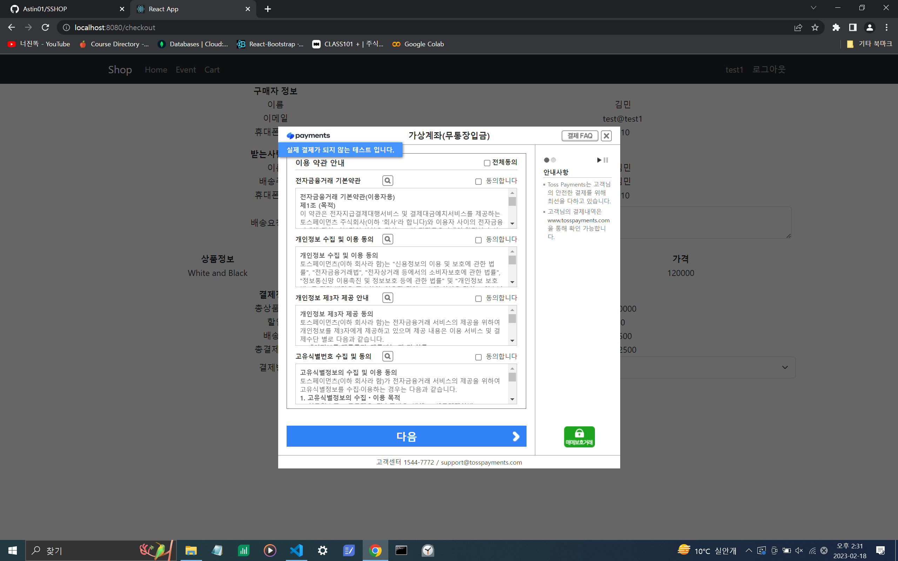

# SSHOP

## Overall

- Site sells shoes

</img>

## Function

- login / logout

- signIn

- recent product

- cart

- pay by card or bank

- chat

## Image

- Login

</img>

- SignIn

</img>

- Product

</img>

- Chat

</img>

- Cart

</img>

- Card

</img>

- Bank

</img>

## Technic

- React

- Redux

- React Bootstrap

- Express

- Mongodb

- Toss payment API

- web socket

- cloudtype

- pwa

## Licese

MIT License

## Linked Repo
- [shop_front](https://github.com/Astin01/shop)
